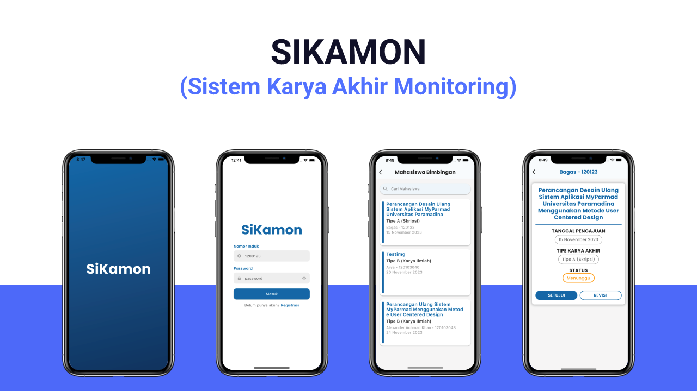
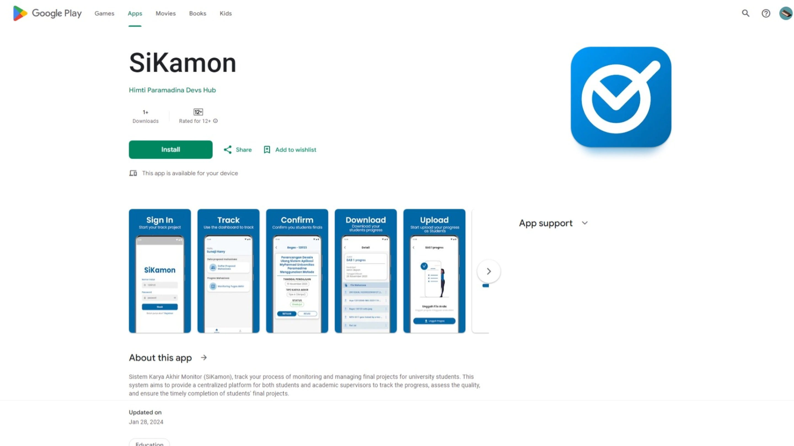

 

# Summaries

Pengembangan Sistem Monitoring Karya Akhir atau disingkat SiKamon, merupakan proyek dengan dosen teknik informatika, yang permasalahannya bahwa di kampus Paramadina masih belum
memiliki sistem untuk memantau karya akhir biasanya buat skripsi. Namun sebelumnya sudah dikembangkan oleh dosen TI Paramadina, yang masih bentuk website dan diskontinu, untuk itu sistem monitoring yang saat ini masih dilakukan secara manual yang berarti harus datang ke kampus untuk melakukan laporan monitoring antara dosen dan mahasiswa.
  

Sistem monitoring ini berhasil dikembangkan dalam kurang lebih selama 5 bulan. Salah satu fitur yang diimplementasi dari untuk mahasiswa yaitu mengunggah karya akhir berupa
skripsi dalam bentuk format file dan juga gambar. Selain itu untuk fitur dosen yang diimplementasi berupa pembuatan forum pengumpulan tugas karya akhir untuk mahasiswa.
  

 

Aplikasi ini sukses digunakan untuk dosen TI di universitas Paramadina, untuk harapan kedepannya fitur yang diimplementasi yaitu dapat membuat dashboard admin, serta kegiatan yang mencakup monitoring maupun dari mahasiswa dan dosen serta skala pengembangannya dapat digunakan oleh seluruh fakultas Paramadina.  

[Link ke aplikasi Playstore](https://play.google.com/store/apps/details?id=com.paramadina.sikamon)
 

