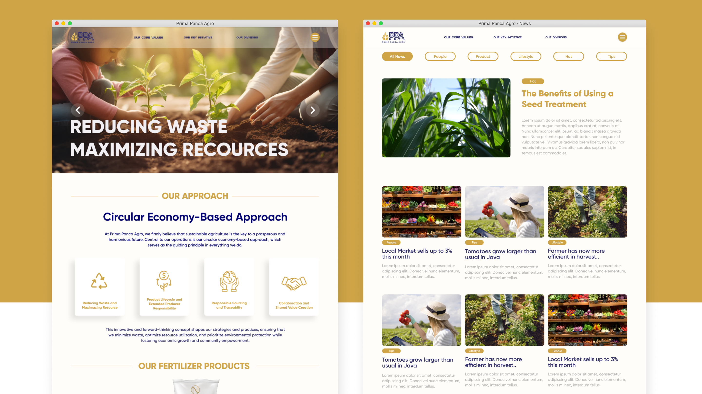

 

# Summaries

Prima Panca Agro merupakan anak perusahaan dari Samora Group yang memfokuskan pada bidang pertanian dan pupuk, selama magang 3 bulan lebih proyek utama yang dikerjakan
yaitu membuat profil landing page perusahaan tersebut, hasil pengembanganya dari websitenya berhasil dieksekusi dengan beberapa koordinasi tim IT. 
  

<!--   -->
<!--   -->

Sementara itu jobdesk yang terkait dengan kerjaan yaitu mengelola akun sosial media Instagram. Seperti mengelola konten - konten untuk brand awareness mengenali
produk - produk gula rafinasi pada instagram @Samoragroup.
  

