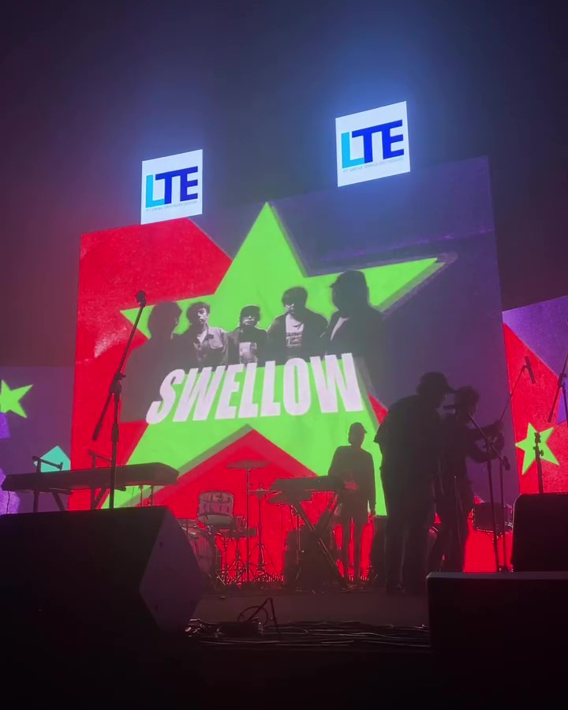

 

# Summaries

Dalam perayaan yang dipandang sebagai tonggak bersejarah bagi SMA Negeri 3 Jakarta, TERAS 2023 telah berhasil menyita perhatian publik dengan kekayaan bakat dan kreativitas siswa-siswi SMAN 3 Jakarta yang dikenal sebagai SMA Teladan.  

TERAS 2023 berhasil memadukan berbagai elemen pertunjukan yang memukau, menampilkan ragam bakat siswa-siswi dalam berbagai bidang seni dan kreativitas. Melalui berbagai pertunjukan yang menghibur dan memukau, acara ini mampu membangkitkan semangat kebanggaan dan rasa persaudaraan di antara seluruh komunitas SMA Negeri 3 Jakarta. Tidak hanya sekadar acara hiburan, TERAS 2023 juga menjadi ajang untuk mengapresiasi dan merayakan prestasi serta kontribusi siswa-siswi dalam menjadikan SMA Negeri 3 Jakarta sebagai lembaga pendidikan yang gemilang selama tujuh dekade. Kehadiran ribuan orang dalam acara ini menjadi bukti nyata betapa TERAS 2023 telah menjadi sorotan dan inspirasi bagi sekolah-sekolah lain dalam menyelenggarakan acara bersejarah yang membanggakan.  

 

# Video
Untuk melihat sepenuhnya dapat bisa dilihat klik video dibawah ini. 

<iframe style="overflow:hidden;width: 100%;height:100%" src="https://www.youtube.com/embed/_yktxN0PaeM?si=daZhjx3bLe1Das0M" title="YouTube video player" frameborder="0" allow="accelerometer; autoplay; clipboard-write; encrypted-media; gyroscope; picture-in-picture" allowfullscreen></iframe>