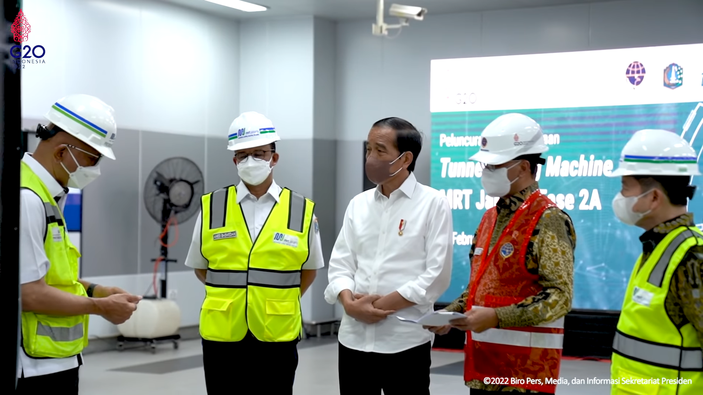
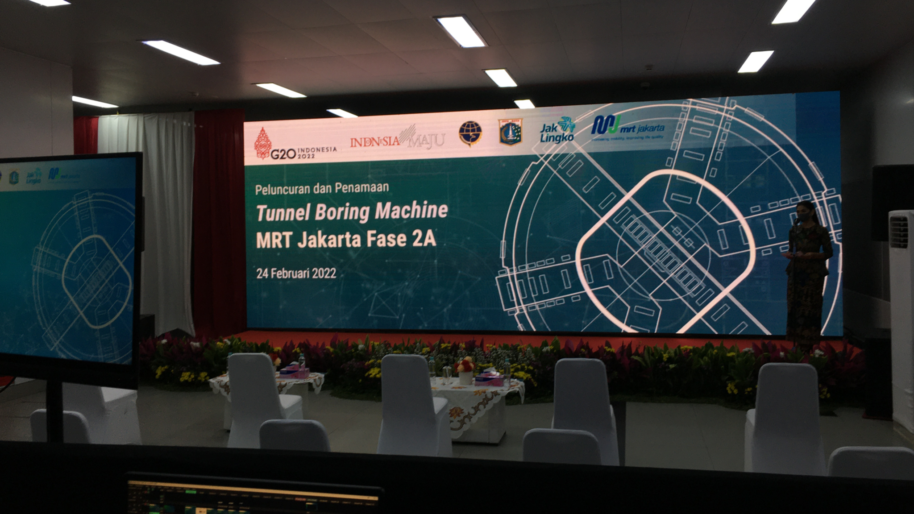

 

# Summaries

Pada acara tersebut dilaksanakan pada hari kamis pagi dengan dihadiri Presiden Indonesia, Gubernur DKI Jakarta dan Direktur MRT, dalam acara tersebut mempresentasikan Mesin Bor (Boring Tunnel) dengan menampilkan visual para pekerja yang melakukan perpanjangan jalur MRT fase 2A.

 

 

 

 

# Videos
Untuk melihat sepenuhnya dapat bisa dilihat diklik video dibawah ini.

 

<iframe width="560" height="315" src="https://www.youtube.com/embed/eZoWsSYWcA0" title="YouTube video player" frameborder="0" allow="accelerometer; clipboard-write; encrypted-media; gyroscope; picture-in-picture" allowfullscreen></iframe>