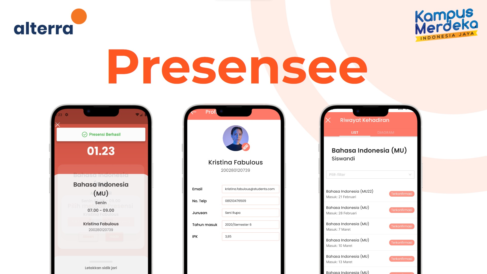
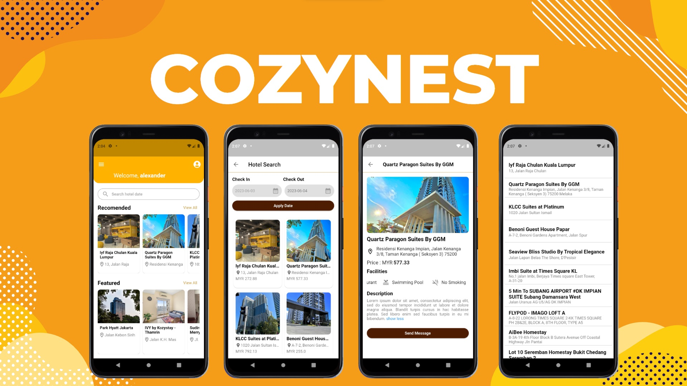

 

# Summaries

Selama Magang/Studi Independen kampus merdeka kurang lebih 5 hingga 6 bulan di PT. Marka Kreasi Persada (Alterra Academy), terdapat beberapa projek utama yang dikerjakan selama disitu seperti miniproject dan capstone project, .   

Untuk mini project timeline pengerjaan yaitu 2 minggu, yaitu saya mengambil tema aplikasi penginapan berjudul [__Cozynest__](https://github.com/xhanalexander/CozyNest). Fitur utama/ Minimun Viable Product (MVP) aplikasi yang dikembangkan seperti memesankan hotel, penggunaan RESTful API dari [RapidAPI](https://rapidapi.com/), Unit dan UI testing, dan implementasi firebase. Di mini projek tersebut sudah dapat ditargetkan pencapaian hasil 1 minggu sekitar 80% fitur MVP yang diimplementasi.  

Pada capstone project timeline pengerjaan yaitu 4 minggu (sebulan), dengan mengambil tema aplikasi sistem manajemen absensi [__Presensee__](https://github.com/Capstone-Alta-18/Presencee-Mobile). Dan fitur MVP pada mobile development yaitu mengirim data absensi menggunakan kamera dan sidik jari dengan berdasarkan waktu kehadiran, penggunaan firebase, dan notifikasi, target penyelesaiannya dicapai dalam 3 minggu lebih dengan persentasi 90% yang dicapai.   

