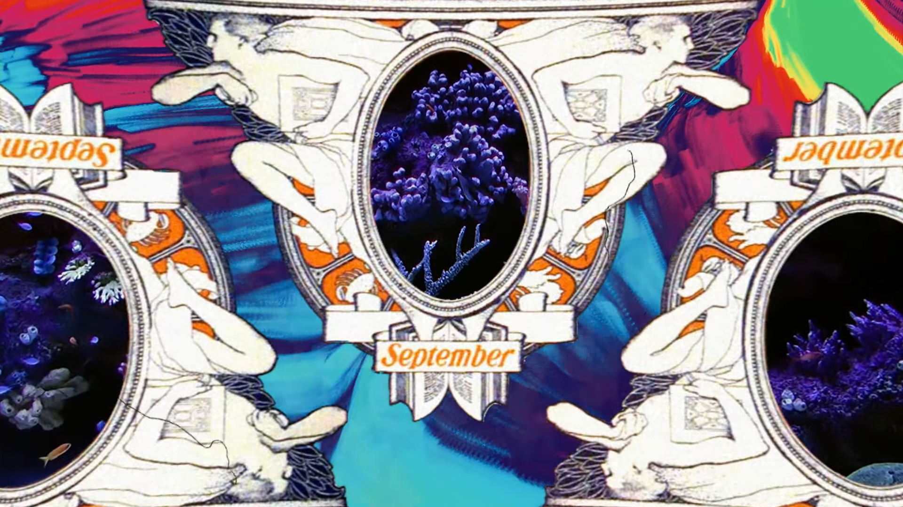

 

# Summaries
Bangkutaman is a group music band from jogja, with consisting genre of Folk/Indie, The new single entitled "Dinamika" was first played specifically through the official pop site today. The single released through the Palm House Records label was a sign of their resurrection after a long time of silence, since last release the mini album entitled "Rilateks" in 2016. The five-minute duration presented by the single "Dinamika" will bring the listeners into the nuances and the world of the psychedelia jazz, which of course this is a new exploration for those who have never played this type of music from 1999.  

 

# Video
Untuk melihat sepenuhnya dapat bisa dilihat diklik video dibawah ini. 

<iframe src="https://www.youtube.com/embed/i0VDVqzVVEQ" class="w-full " title="YouTube video player" frameborder="0" allow="accelerometer; autoplay; clipboard-write; encrypted-media; gyroscope; picture-in-picture" allowfullscreen></iframe>