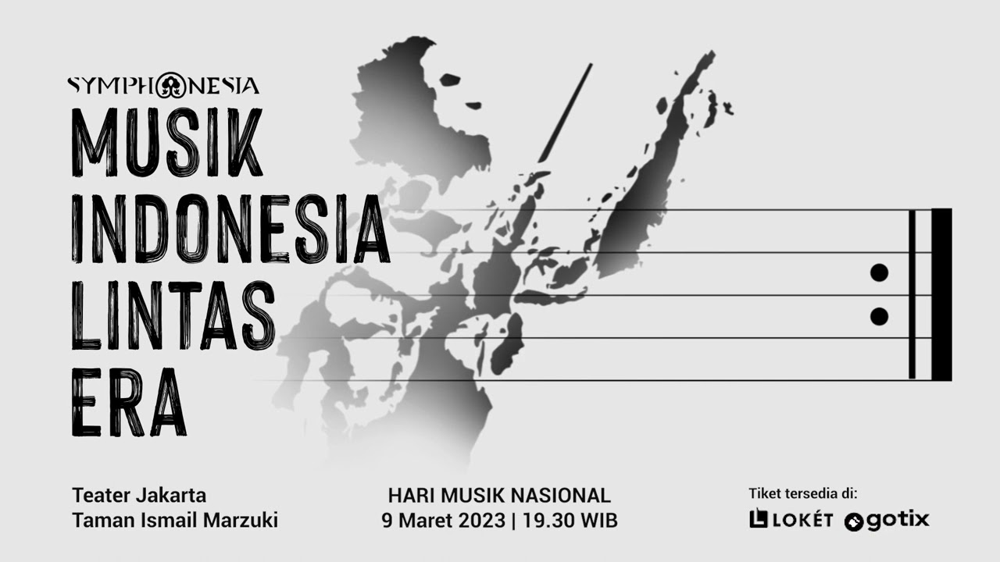
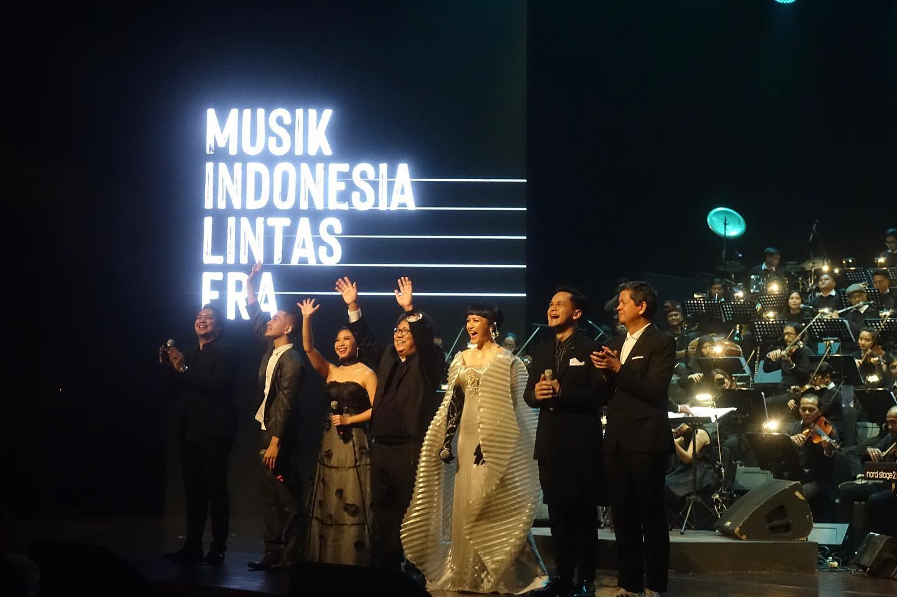
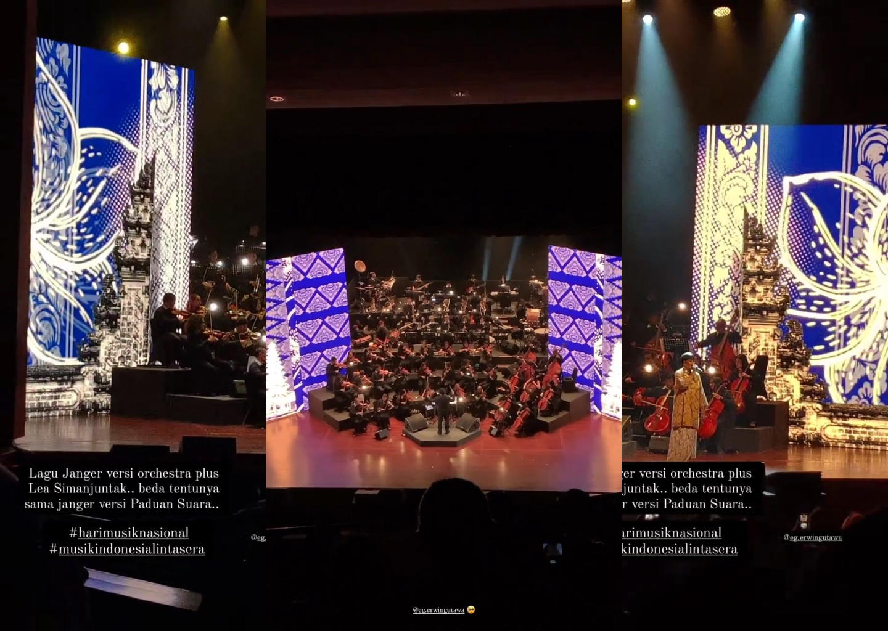

 

# Event
Merayakan Hari Musik Nasional, Orkestra Erwin Gutawa menawarkan rangkuman perjalanan industri musik Indonesia yang dikemas dalam bentuk pertunjukan musikal. Menampilkan karya-karya musik ikonik dari tahun 60-an hingga terbaru, sambil menceritakan kisah di balik fenomenanya. "Indonesian Music Across Eras" juga menampilkan Candra Darusman, Donnie Sibarani, Lea Simanjuntak, Rafi Sudirman, Gabriel Harvianto, dan Andrea Miranda.   

Tahun 2023 ini menandakan bahwa sang maestro telah genap 38 tahun berkarya. Hingga kini, nama ayah dari Gita Gutawa tersebut masih sangat lekat dengan permusikan Indonesia, terlebih orkestra. Ia pun menyiapkan sesuatu yang spesial untuk merayakan Hari Musik Nasional 2023 yang jatuh pada tanggal 9 Maret ini. Erwin Gutawa Orchestra adakan sebuah konser bertajuk Symphonesia: Musik Indonesia Lintas Era di Taman Ismail Marzuki (TIM) yang menyuguhkan rangkuman perjalanan musik Indonesia. 
<a href="https://www.instagram.com/p/CpmwHodpvti/" class='text-green-400'>video singkat</a>

 

 

 

# Video
Untuk melihat sepenuhnya dapat bisa dilihat diklik video dibawah ini. 

<iframe class='w-full' src="https://www.youtube.com/embed/eUh7XUZehNI" title="YouTube video player" frameborder="0" allow="accelerometer; autoplay; clipboard-write; encrypted-media; gyroscope; picture-in-picture; web-share" allowfullscreen></iframe>

