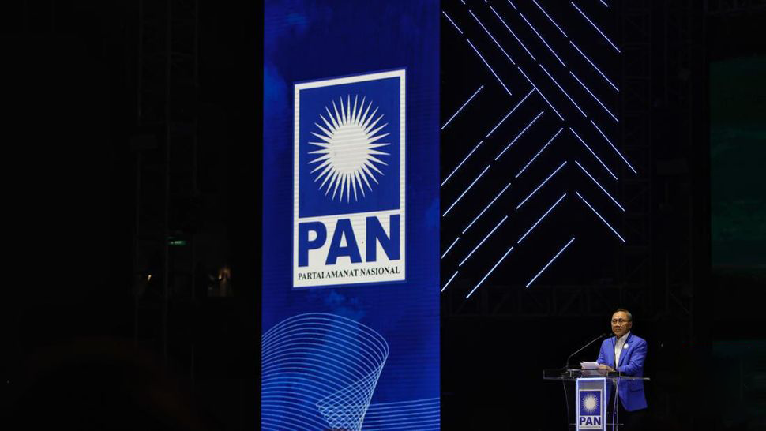

 

# Events
PAN akan menggelar rakernas pada tanggal 26 Agustus 2022. Yang salah satu agenda-nya strategis dalam rakernas ini adalah penyampaian rekomendasi calon presiden dari struktur bawah partai.

 

 

 

 

# Videos
Untuk melihat sepenuhnya dapat bisa dilihat diklik video dibawah ini. 

<iframe width="560" height="315" src="https://www.youtube.com/embed/vKD1xEWORJc" title="YouTube video player" frameborder="0" allow="accelerometer; autoplay; clipboard-write; encrypted-media; gyroscope; picture-in-picture" allowfullscreen></iframe>