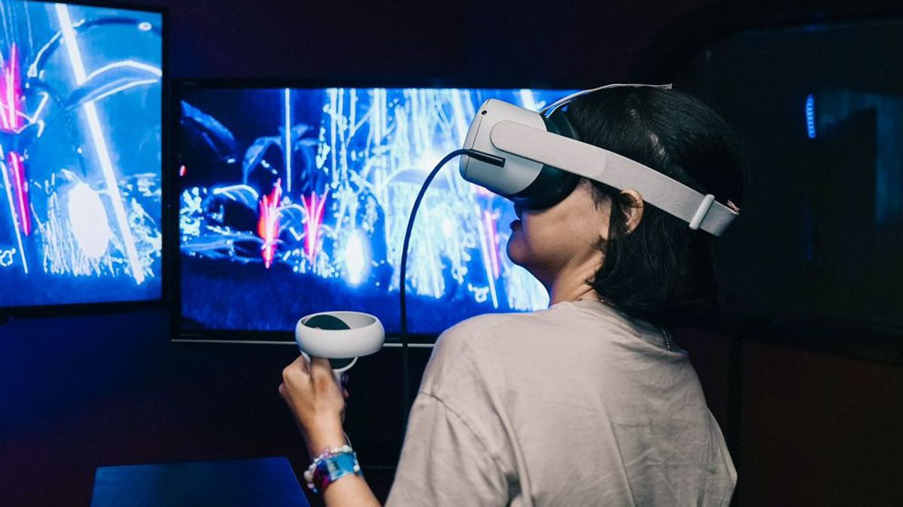
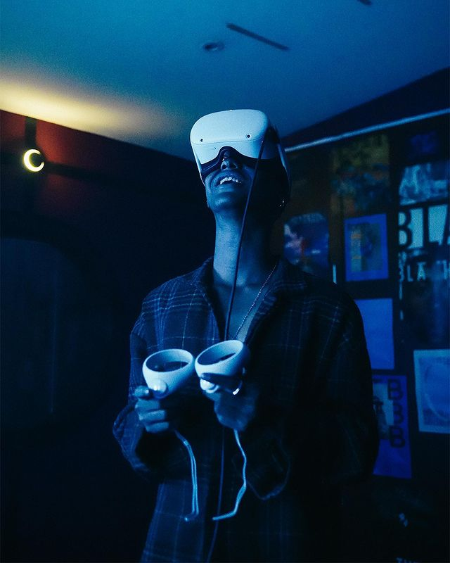

 

# Summaries

Tripo 3000 sendiri telah mengadakan berbagai macam acara yang memenangkan awards sejak 2008. Tripo 3000 merupakan divisi Event Organizer dari 3000 Group yang secara konsisten membawa ide-ide yang lebih maju dari waktu ke waktu, terus berinovasi memberikan elemen-elemen kejutan dalam berbagai acara lifestyle yang dibawakan di Ding Dong Disko, section b, dan A3000 Creative Compound. Mereka selalu berhasil membawakan konsep ‘Future-Oriented Junk’ yang disenangi dan menjadi pusat hiburan di Jakarta.  

Konsepnya berkisar pada bentuk seni multidimensi, mulai dari visual art mapping hingga virtual reality, dilengkapi kolaborasi dengan pertunjukan musik elektronik yang beragam. Seperti pada edisi sebelumnya, A3000 Creative Compound akan menampilkan visual mapping dan motion graphics yang memukau.  

Pengunjung yang menghadiri acara tersebut akan memiliki kesempatan untuk membenamkan diri dalam pengalaman yang tak terlupakan dengan menjelajahi berbagai dunia maya menggunakan teknologi VR dan berinteraksi dengan karya seni interaktif lainnya yang dipamerkan. Seluruh pengalaman akan dirasakan secara bersamaan, menjadikannya benar-benar unik. 
<a href="https://www.instagram.com/p/Cr56-AiyQqT/?img_index=1" class='text-green-400'>Postingan</a>  

